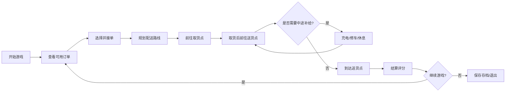

## 1. 产品概述

城市送货模拟器是一款策略经营类网页游戏，玩家扮演一名城市送货员，在小城市地图上接单送货。游戏需要玩家综合考虑天气、体力、电量、路线距离等因素，高效完成配送任务以获得最高评分。

- **主要用途**：休闲策略游戏，体验城市送货的挑战与乐趣
- **目标用户**：休闲游戏爱好者、策略游戏玩家
- **市场价值**：无需下载的轻量化网页游戏，具有高度可重玩性

## 2. 核心功能

### 2.1 用户角色

| 角色 | 注册方式 | 核心权限 |
|------|----------|----------|
| 玩家 | 本地存档 | 完整游戏体验、数据存档与读取 |

### 2.2 功能模块

1. **主游戏界面**：城市地图、角色状态、订单面板、操作控制
2. **订单系统**：订单生成、接单、配送、结算评分
3. **环境系统**：天气变化、雨势影响、道路状态
4. **车辆系统**：移动控制、电量管理、车辆维修
5. **经济系统**：收入计算、迟到扣款、结算评分
6. **存档系统**：本地JSON存档、读取进度

### 2.3 页面详情

| 页面名称 | 模块名称 | 功能描述 |
|----------|----------|----------|
| 主游戏界面 | 地图渲染 | 2D城市地图渲染、道路网络、建筑图标、玩家位置实时显示 |
| 主游戏界面 | 状态面板 | 显示当前体力、电量、金钱、天气、时间 |
| 主游戏界面 | 订单面板 | 显示可用订单、已接订单、配送进度 |
| 主游戏界面 | 操作面板 | 移动控制、接单、充电、修车、规划路线按钮 |
| 主游戏界面 | 结算弹窗 | 订单完成时显示收入、扣款、评分详情 |
| 存档界面 | 存档管理 | 保存游戏进度、读取进度、开始新游戏 |

## 3. 核心流程

玩家进入游戏后，首先查看可用订单，选择合适的订单接单。接单后需要规划最优配送路线，考虑当前天气（雨势影响速度）、车辆电量和自身体力状态。在配送过程中，可能需要中途充电或修车。完成配送后系统根据配送时间、客户满意度等进行结算评分。游戏进度自动保存到本地JSON。

## 4. 用户界面设计

### 4.1 设计风格

**像素风格城市主题**
- **主色调**：深蓝色夜空 (#0a1628)、暖黄色街灯 (#ffcc4d)、霓虹青色 (#00ffcc)
- **辅助色**：雨天蓝灰色 (#4a6fa5)、警告红色 (#ff4757)、成功绿色 (#2ed573)
- **按钮风格**：圆角矩形，像素边框，悬停时有发光效果
- **字体**：Press Start 2P (像素风格标题) + VT323 (等宽像素正文)
- **布局风格**：主地图居中，左侧状态面板，右侧订单面板，底部操作栏
- **图标风格**：像素风emoji和SVG图标

### 4.2 页面设计概述

| 页面名称 | 模块名称 | UI元素 |
|----------|----------|--------|
| 主游戏界面 | 地图区域 | Canvas渲染的2D城市网格，道路、建筑、车辆、天气粒子效果 |
| 主游戏界面 | 状态面板 | 进度条显示体力/电量，数字显示金钱/时间，天气图标 |
| 主游戏界面 | 订单面板 | 卡片式订单列表，显示取/送货点、报酬、剩余时间 |
| 主游戏界面 | 操作栏 | 方向键或WASD控制移动，功能按钮（接单、充电、修车） |
| 结算弹窗 | 结算面板 | 详细收入明细、扣分原因、星级评分 |

### 4.3 响应式

- **Desktop-first**设计，主游戏区域固定1200x700像素
- 移动端适配为垂直布局，地图区域响应式缩放
- 触摸操作优化：虚拟方向键、大按钮

### 4.4 视觉特效

- **雨天效果**：Canvas粒子雨，雨滴大小和密度随雨势变化
- **车辆移动**：像素动画，轮胎滚动效果，车灯开关
- **街灯效果**：光晕闪烁，夜间自动点亮
- **状态变化**：低电量时屏幕边缘红色警告脉动
