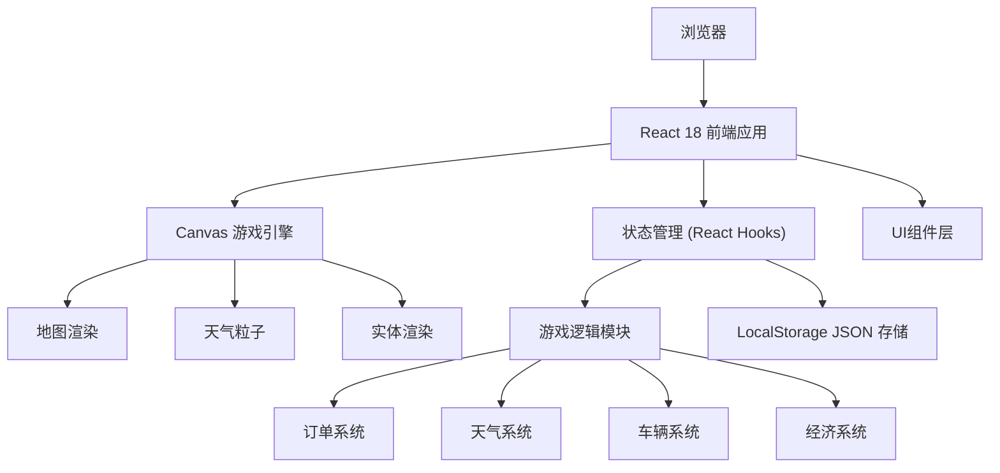

## 1. 架构设计



## 2. 技术描述

- **前端框架**：React@18 + TypeScript + Vite@5
- **样式方案**：TailwindCSS@3 + 自定义CSS变量
- **游戏渲染**：HTML5 Canvas 2D API
- **状态管理**：React useReducer + useContext
- **数据存储**：LocalStorage 存储 JSON 格式数据
- **初始化工具**：vite-init

## 3. 目录结构

```
src/
├── components/          # React UI组件
│   ├── StatusPanel.tsx     # 状态面板
│   ├── OrderPanel.tsx      # 订单面板
│   ├── ControlBar.tsx      # 操作控制栏
│   ├── GameMap.tsx         # 地图Canvas组件
│   ├── SettlementModal.tsx # 结算弹窗
│   └── SaveLoadModal.tsx   # 存档弹窗
├── game/               # 游戏核心逻辑
│   ├── types.ts           # TypeScript类型定义
│   ├── constants.ts       # 游戏常量配置
│   ├── mapData.ts         # 地图数据
│   ├── GameEngine.ts      # 游戏引擎核心
│   ├── OrderSystem.ts     # 订单系统
│   ├── WeatherSystem.ts   # 天气系统
│   ├── VehicleSystem.ts   # 车辆系统
│   ├── EconomySystem.ts   # 经济系统
│   └── Storage.ts         # 本地存储管理
├── hooks/              # 自定义Hooks
│   └── useGameLoop.ts     # 游戏循环Hook
├── App.tsx              # 主应用组件
├── main.tsx             # 入口文件
└── index.css            # 全局样式
```

## 4. 数据模型

### 4.1 实体关系图

```mermaid
erDiagram
    PLAYER ||--|| VEHICLE : "驾驶"
    PLAYER ||--o{ ORDER : "接单"
    PLAYER ||--o{ INCOME_RECORD : "收入记录"
    ORDER ||--|| LOCATION : "取货点"
    ORDER ||--|| LOCATION : "送货点"
    WEATHER ||--o VEHICLE : "影响速度"
```

### 4.2 数据定义

#### 玩家状态 (PlayerState)
```typescript
interface PlayerState {
  id: string;
  name: string;
  money: number;
  stamina: number;      // 体力 0-100
  maxStamina: number;
  position: { x: number; y: number };
  currentOrderId: string | null;
  completedOrders: number;
  totalRating: number;
}
```

#### 车辆状态 (VehicleState)
```typescript
interface VehicleState {
  id: string;
  battery: number;      // 电量 0-100
  maxBattery: number;
  durability: number;   // 耐久度 0-100
  maxDurability: number;
  speed: number;        // 当前速度
  baseSpeed: number;
  position: { x: number; y: number };
}
```

#### 订单 (Order)
```typescript
interface Order {
  id: string;
  pickupLocation: { x: number; y: number; name: string };
  deliveryLocation: { x: number; y: number; name: string };
  reward: number;
  deadline: number;      // 剩余时间(秒)
  maxDeadline: number;
  status: 'available' | 'accepted' | 'pickedup' | 'delivering' | 'completed' | 'failed';
  customerUrgency: number; // 1-5 客户催单程度
  distance: number;
  createdAt: number;
}
```

#### 天气状态 (WeatherState)
```typescript
interface WeatherState {
  type: 'sunny' | 'cloudy' | 'rainy' | 'heavy_rain' | 'storm';
  intensity: number;    // 0-100 雨势强度
  speedModifier: number; // 速度影响系数
  nextChangeTime: number;
}
```

#### 地图数据 (MapData)
```typescript
interface MapData {
  width: number;
  height: number;
  gridSize: number;
  roads: Road[];
  buildings: Building[];
  chargingStations: Location[];
  repairShops: Location[];
}

interface Road {
  id: string;
  type: 'horizontal' | 'vertical' | 'intersection';
  x: number;
  y: number;
  width: number;
  height: number;
}

interface Building {
  id: string;
  name: string;
  type: 'residential' | 'commercial' | 'industrial';
  x: number;
  y: number;
  width: number;
  height: number;
  color: string;
}

interface Location {
  id: string;
  name: string;
  type: 'charging' | 'repair' | 'pickup' | 'delivery';
  x: number;
  y: number;
}
```

#### 收入记录 (IncomeRecord)
```typescript
interface IncomeRecord {
  id: string;
  orderId: string;
  baseReward: number;
  latePenalty: number;
  bonus: number;
  finalAmount: number;
  rating: number;       // 1-5星
  completedAt: number;
}
```

#### 游戏存档 (GameSave)
```typescript
interface GameSave {
  version: string;
  savedAt: number;
  player: PlayerState;
  vehicle: VehicleState;
  weather: WeatherState;
  orders: Order[];
  incomeRecords: IncomeRecord[];
  gameTime: number;     // 游戏内时间
  map: MapData;
}
```

## 5. 核心系统设计

### 5.1 游戏循环
- 使用 `requestAnimationFrame` 实现 60fps 游戏循环
- 固定时间步长处理物理和逻辑更新
- 分离更新逻辑与渲染逻辑

### 5.2 寻路算法
- A* 寻路算法计算最短路径
- 考虑天气影响调整路径权重
- 支持动态路径重新规划

### 5.3 碰撞检测
- 基于网格的碰撞检测
- 建筑和道路边界检测
- 简化的矩形碰撞检测

### 5.4 事件系统
- 订单生成事件
- 天气变化事件
- 配送超时事件
- 状态变化通知
